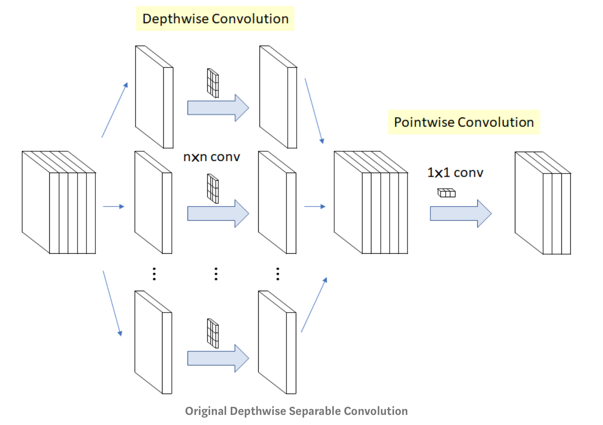
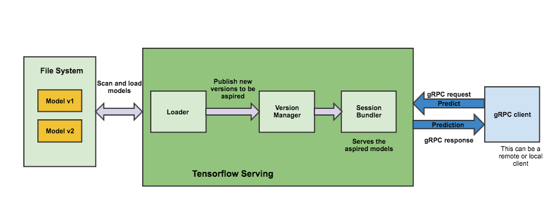
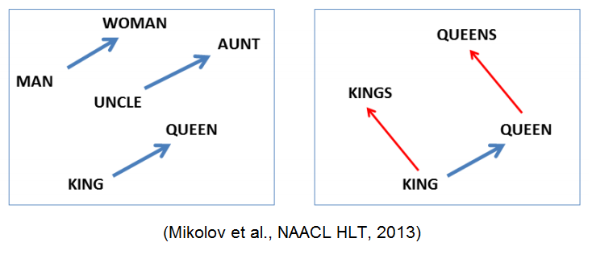
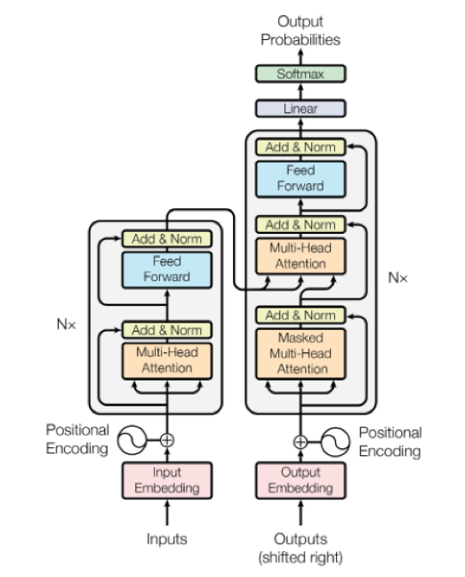
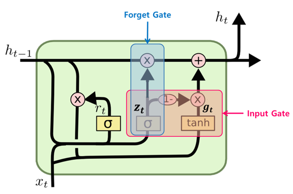
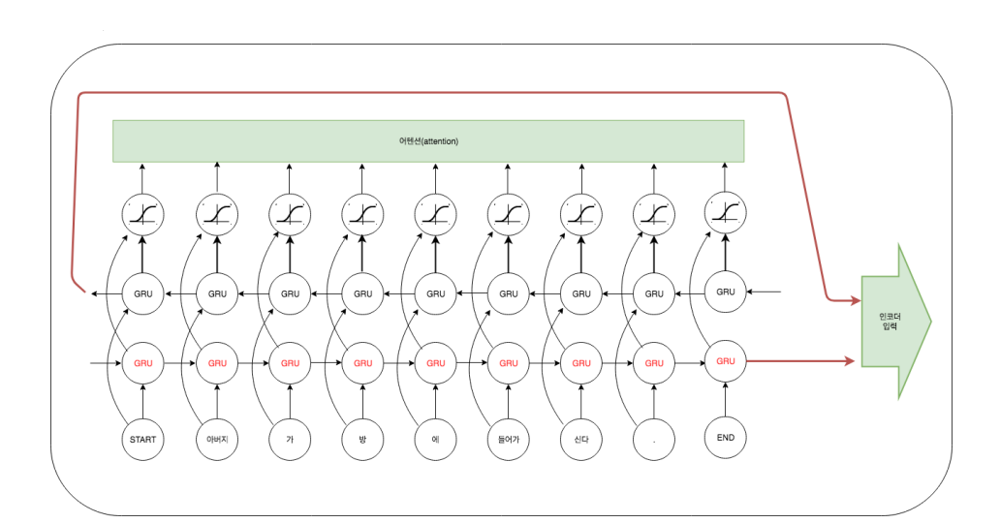
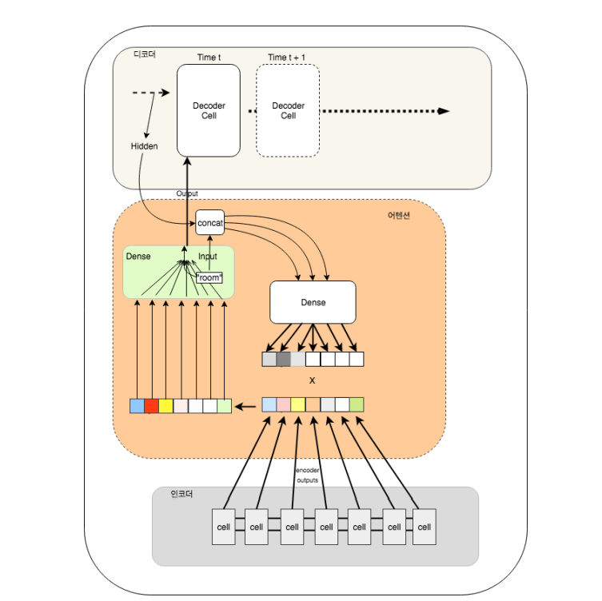
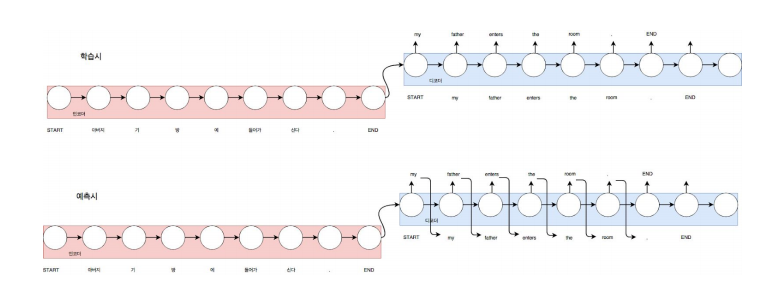

# 특화-Sub PJT III

## 영일이 - 영수증을 일제히 이 곳에

### Tech

             


### Introduction

영일이는 해외 영수증 관리 어플리케이션입니다. OCR, NMT, 딥러닝 기술을 이용해 해외 영수증 번역, 실시간 환율 계산, 지출 내역 관리 등의 서비스를 제공하는 해외 영수증 관리 앱입니다.

1. 이미지 업로드
2. 이미지 영수증 여부 확인
3. 영수증 기울기 여부 확인
4. 이미지 텍스트 데이터화
5. 텍스트 카테고리 분류
6. 텍스트 번역
7. 사용자 기호에 따라 데이터 수정 및 저장

의 과정을 통해 해외의 영수증을 저장하고 관리할 수 있습니다.


### Installation

#### 0) venv

- Anaconda
- Yarn

가상환경으로 Anaconda와 Yarn을 권장합니다.


#### 1) FrontEnd

```bash
$ cd FrontEnd
$ yarn

$ yarn serve
```


#### 2) BackEnd

##### Ubuntu

```bash
$ git clone https://lab.ssafy.com/s02-ai-sub3/s02p23a408
$ cd BackEnd
$ pip install -r requirements_ubuntu.txt

$ python manage.py runserver
```

Ubuntu의 경우 Mecab 기능을 사용하기 위해 Konlpy 라이브러리를 사용합니다.

##### Windows

```bash
$ git clone https://lab.ssafy.com/s02-ai-sub3/s02p23a408
$ cd BackEnd
$ pip install -r requirements_windows.txt

$ python manage.py runserver
```

Windows의 경우 Mecab 기능을 사용하기 위해 Eunjeon 라이브러리를 사용합니다.


### Features

#### 1) Receipt Dectection

##### 개요

영수증인지 아닌지를 판별하는 분류모델에서 구글의 MobileNet V2를 사용했습니다. Transfer Learning을 통해 이미 학습된 모델을 가져온 후 마지막 classifier 부분만 학습되도록 진행하였습니다.

##### Why MobileNet

막대한 컴퓨팅파워를 가진 환경이라면 어떤 모델을 넣더라도 학습과 추론에 전혀 문제가 되지 않습니다. 하지만 우리가 목적으로 하는 서비스는 아래의  조건을 충족해야합니다.

1. GPU가 없는 서버에서 돌아가야하고
2. 영수증을 판별하는 부분이 서비스의 시작 부분이기 때문에 빠른 결과물을 보여줘야 한다.

고성능 환경을 고려한 모델을 사용한다면 결과를 보기 전에 훈련하는 것조차 힘들 수 있기에 컴퓨터 성능이 제한되거나 배터리 퍼포먼스가 중요한 곳에서 사용될 목적으로 설계된 CNN 구조인 MobileNet 모델을 사용하게 되었습니다. MobileNet V2 모델은 기존의 MobileNet에서 CNN구조를 약간 더 수정하여 파라미터 수와 연산량을 더욱 줄인 네트워크입니다. 이 모델을 사용한다면 ResNet, VGGNet과 같은 모델과 비교했을 때 비교적 퍼포먼스가 떨어질 순 있지만, 경량화된 모델을 사용함으로써 빠른 결과물을 얻을 수 있습니다.

##### MobileNet

MobileNet의 아키텍처는 다음과 같습니다.



depthwise convolution은 채널별로 분리하여 각 채널을 개별 커널로 convolution 하는 것입니다.
이때, 입력의 채널과 출력의 채널은 항상 같습니다.
pointwise convolution은 출력의 채널을 바꿀 수 있으며, 1x1 conv하는 것을 말합니다.
이렇게 하면 어떤 장점이 있는지 파라미터량 관점에서 확인해 보겠습니다.
예를들어 3x3x3의 입력이 들어왔을 때 convolution 연산을 통해 3x3x3의 출력을 내고 싶은 경우를 가정하겠습니다.

1. 기존의 convolution의 경우,

3x3x3의 커널이 3개이므로 파라미터량은 3x3x3x3=81

2. depthwise separable convolution의 경우,

3x3x1의 커널이 3개(depthwise), 1x1x3의 커널이 3개이므로 파라미터량은 3x3x1x3+1x1x3x3=27+9=36
위와 같이 파라미터수를 획기적으로 줄일 수 있습니다.

##### Model Serving

딥러닝 모델을 만들고나면, Product에 모델을 배포해야 합니다. 이 모델을 추가하는 과정은 직접 API를 만드는 것과 Tensorflow Serving API를 사용하는 것이 있습니다.

- Model Serving 한다는 것은 inference를 의미. 대표적인 3가지 방법
- Tensorflow Serving
  - Tensorflow Serving
  - 다른 언어 : bazel 빌드
  - Serving시 Python 사용하면 퍼포먼스가 상대적으로 좋지 않음
  - 어려운 이유
    - C++ code, Tensorflow 사용하는 사람들은 대부분 Python만 익숙
    - Kubernetes gRPC, bazel 등 낯선 용어 투성이
    - Compile 필요하고 오래 걸림
- Google Cloud CloudML
  - 장점 : 쉬움! CloudML이 다 해줌
  - 단점 : 비용 발생
- Flask를 사용한 API
  - 장점 : 빠르게 prototype 만들 때 사용 가능
  - 단점 : 초당 API Request가 많은 대용량 서비스라면 사용하기 힘듦(퍼포먼스 이슈)

정리하면 Tensorflow Serving보다 다른 방법(CloudML, Flask)은 상대적으로 쉬운 편이고, CloudML은 노드 시간당 비용이 발생하고, Flask 사용한 방법은 대용량 Request에 버티기 힘들다는 것입니다.
결국 주어진 상황에 따라 유동적으로 방법을 선택하면 되는데 docker 가상환경을 사용하게되면 Tensorflow Serving도 쉽게 사용할 수 있기 때문에, Tensorflow Serving을 사용하게 되었습니다.

##### Tensorflow Serving

텐서플로 서빙의 아키텍처는 다음과 같습니다.



- 파란색 : Client
- 초록색 : Server
- 연두색 : 여러 Model들(v1, v2 ...)
- gRPC
  - RPC의 일종
  - GET / POST만 존재


#### 2) Calculate Receipt Angle

`Models/test/check_forward/check_forward.py`

```python
from skimage.filters import threshold_local
import numpy as np
import argparse
import cv2
import imutils

image = cv2.imread(args["image"])
ratio = image.shape[0] / 500.0
orig = image.copy()
image = imutils.resize(image, height = 500)
```

이미지를 항상 같은 크기로 불러와서 분석합니다.


```python
# ...

gray = cv2.cvtColor(image, cv2.COLOR_BGR2GRAY)
```

외부 환경과 이미지를 분리하기 위해 grayscale 이미지로 변환합니다.


```python
# ...

gray = cv2.GaussianBlur(gray, (5, 5), 0)
```

grayscale 이미지에서 텍스트로 인한 노이즈를 줄이기 위해 GaussianBlur 필터를 적용합니다.


```python
# ...

kernel = cv2.getStructuringElement(cv2.MORPH_RECT, (9, 9))
dilated = cv2.dilate(gray, kernel)
```

이미지의 작은 구멍을 채우기 위해 Dilation을 적용합니다. kernel로 MORPH_RECT를 사용합니다.


```python
# ...

edged = cv2.Canny(dilated, 75, 200)
```

edge detecting을 위해 Canny Edge Detection을 사용합니다.


```python
# ...

cnts = cv2.findContours(edged.copy(), cv2.RETR_TREE, cv2.CHAIN_APPROX_TC89_KCOS)
cnts = imutils.grab_contours(cnts)
```

opencv의  외곽선 찾기 기능인 findContours를 이용해 외곽선을 찾습니다.


```python
# ...


cnts = list(map(lambda c: np.int0(cv2.boxPoints(cv2.minAreaRect(c))), cnts))
cnts = sorted(cnts, key = cv2.contourArea, reverse = True)[:5]

screenCnt = cnts[0]
```

대략적인 외곽선이 필요하기에 사각형 형태의 외곽선을 도출하고 그 중 넓이가 가장 큰 값을 이용합니다.


```python
# ...

# Calculate angles
xs = [num[0] for num in screenCnt]
ys = [num[1] for num in screenCnt]
angles = np.arctan([
	(ys[0]-ys[1]) / (xs[0]-xs[1]),
	(ys[1]-ys[2]) / (xs[1]-xs[2]),
])

# rotation angle
rotation_angle = abs(np.rad2deg(angles[0]))
print('rotation angle: ', rotation_angle)


# tilted angle
titled_angle = abs(np.rad2deg(angles[0] - angles[1]))
print('tilted angle: ', titled_angle)

# image area ratio
area = cv2.contourArea(screenCnt)
image_area = image.shape[0] * image.shape[1]
print(image_area)
print('area ratio: ', area / image_area)

```

각각 필요한 값을 구합니다.


#### 3) OCR

`BackEnd/ZeroOneTwo/gateway/naver_ocr.py`

```python
import os
import sys
import urllib.request
import json
import requests
from IPython import embed
import pickle
import pprint
import base64
from decouple import config


def image_NAVER_AI(img_64, country):
    TEMPLATE = {
        "images": [
        {
            "format": "jpg",
            "name": "medium",
            "data": img_64
        }
        ],
            "requestId": "string",
            "resultType": "string",
            "timestamp" : "1",
            "version": "V1"
    }
    
    transmit = json.dumps(TEMPLATE)
    
    data = transmit
    client_secret = config('NAVER_OCR_CLIENT_SECRET_JP') if country=='jp' else config('NAVER_OCR_CLIENT_SECRET_EN')
    url = config('NAVER_OCR_URL_JP') if country=='jp' else config('NAVER_OCR_URL_EN')
    request = urllib.request.Request(url)
    request.add_header("X-OCR-SECRET", client_secret)
    request.add_header("Content-Type", "application/json")

    response = urllib.request.urlopen(request, data=data.encode("utf-8"))
    rescode = response.getcode()

    if(rescode==200):
        response_body = response.read()
        result_str = response_body.decode('utf-8')
        result_dict = json.loads(result_str)
        return result_dict
    else:
        return None

```

Naver Cloud Platform에서 제공하는 Naver OCR API를 이용해 Text를 추출합니다.


#### 4) Text Classification

`Models/parse/parse.py`

```python
import json
import re
from pprint import pprint

"""
OCR 이후 데이터 파싱은 현재 영어와 일본어가 지원됩니다. 
알파벳을 사용하는 언어는 영어 함수를 사용합니다. 일단은 
사용할 함수에 json 형식의 데이터를 넣으면 title, date, items, total 값을 반환합니다. 
결과가 좋지 않을 경우 당황하지 말고 담담히 받아들이면 됩니다. 
"""


def parse_en(content):
    # 줄 간격 설정
    min_font_sizes = []
    for c in content["images"][0]["fields"]:
        temp_font_size = max(
            map(lambda y: y["y"], c["boundingPoly"]["vertices"])
        ) - min(map(lambda y: y["y"], c["boundingPoly"]["vertices"]))
        min_font_sizes.append(temp_font_size)
    min_font_size = min(min_font_sizes)

    # 한 줄 만들기
    texts = []
    temp_texts = []
    temp_y = 0
    for c in content["images"][0]["fields"]:
        max_y = max(map(lambda y: y["y"], c["boundingPoly"]["vertices"]))
        if abs(temp_y - max_y) > min_font_size and temp_texts != []:
            texts.append(temp_texts)
            temp_texts = []
        temp_max = max(list(map(lambda x: x["x"], c["boundingPoly"]["vertices"])))
        temp_min = min(list(map(lambda x: x["x"], c["boundingPoly"]["vertices"])))
        temp_texts.append({"text": c["inferText"], "min": temp_min, "max": temp_max})
        temp_y = max_y
    texts.append(temp_texts)

    # 품목, 날짜
    r_items = r"[\d]+[.,][\d]*|TOTAL|TOTAAL"
    r_date = r"[\d]+[/:][\d]*"
    r_total = r"^TOTAL|GRAND TOTAL|^TOTAAL"
    r_int = r"[\d]+"
    r_filters = (
        r"TOTAL|SERVICE|CHANGE|MANAGER|BALANCE|TAX|TOTAAL|ROUNDING|TIP|^[\d.,\s]*$"
    )

    temp_max = 0
    temp_min = 0
    temp_items = []
    title = ""
    items = []
    date = []
    for idx, text in enumerate(texts):
        text_list = list(map(lambda x: x["text"], text))
        if idx == 0:
            title = " ".join(text_list)
        # x min max 를 이용해 품목인지 확인
        if any(re.search(r_items, t.upper()) for t in text_list):
            new_max = max(list(map(lambda x: x["max"], text)))
            new_min = min(list(map(lambda x: x["min"], text)))
            if abs(temp_max - new_max) > 2 and abs(temp_min - new_min) > 2:
                items.append(temp_items)
                temp_items = [" ".join(text_list)]
            else:
                temp_items.append(" ".join(text_list))
            temp_max, temp_min = new_max, new_min
        if any(re.search(r_date, t) for t in text_list):
            date.append(" ".join(text_list))
    items.append(temp_items)

    result = {}
    result["title"] = title
    result["date"] = date[0] if date else ""

    # Total, TOTAL. Grand Total
    total_str = ""
    for i in sum(items, []):
        if re.search(r_total, i.upper()):
            total_strs = re.findall(r_int, i)
            for idx, s in enumerate(total_strs):
                if idx == len(total_strs) - 1 and len(total_strs) != 1 and len(s) == 2:
                    total_str += f".{s}"
                else:
                    total_str += s
    result["total"] = total_str

    r_price = r"[\d.,\s]*$"
    individual_items = list(
        filter(lambda x: len(x) == max(map(lambda y: len(y), items)), items)
    )
    items_result = []
    item_id = 1
    for i in individual_items[0]:
        if re.search(r_filters, i.upper()):
            continue
        else:
            r_usd = re.compile(r"(USD)$")
            j = r_usd.sub("", i)
            price = re.findall(r_price, j)
            price_org = "".join(price)
            price_str = price_org.replace(" ", "")
            if price_str[-3] in [",", "."]:
                price_str = price_str.replace(",", "").replace(".", "")
                price_str = price_str[:-2] + "." + price_str[-2:]
            else:
                price_str = price_str.replace(",", "").replace(".", "")
            r_price_filter = re.compile(price_org + r"|€|£")
            item = r_price_filter.sub("", j)
            items_result.append({"item_id": item_id, "item": item, "price": price_str})
            item_id += 1
    result["items"] = items_result

    return result
```

OCR에서 제공하는 위치데이터와 정규표현식을 이용해 Text Classification을 적용합니다. 현재 영어와 일본어가 가능합니다. 위 코드는 영어 데이터 분류 버전입니다. 

OCR post-processing은 Text correction(error correction)과 Data parsing(text classification), 두 가지 작업이 진행 될 수 있습니다. Text correction은 학습된 모델을 통해 오타 혹은 잘못 인식된 글자를 보정하는 작업입니다. Text classification은 주로 정규표현식을 이용해서 하고 있지만 최근 clova에서 NLP를 이용하는 방법을 논문으로 발표한 바 있습니다. 


#### 5) NMT

##### 개요

Neural Machine Translation을 위해 Apache의 MXNet Gluon을 사용했습니다. 영한 번역만 지원됩니다.

##### Why Gluon?

Tensorflow는 API가 직관적이지 않으며 딥러닝 영역도 생소합니다. 그와 더불어 디버깅이 어려워 정확하게 원하는 방향으로 모형을 만들었는지 확인이 힘듭니다. 이 부분에서 보통 Keras를 이용해 모델을 구현하면 수 많은 레퍼런스가 존재합니다. 하지만 NLP 모델링을 위해 seq2seq를 구현하는 것에 Keras로 구현하기 매우 힘듭니다. 디버깅에 더욱 직관적인 모델로 Gluon을 사용하기로 결정합니다.

Gluon은 TensorFlow의 Symbolic 방식과 Pytorch의 Imperative 방식을 모두 지원합니다.

##### NMT

병렬 코퍼스를 제공하면 어떠한 언어쌍이든지 문법체계와 상관없이 번역모형을 생성합니다. 오류 수정과 GPU 리소스를 많이 필요하다는 단점이 있습니다. 데이터셋이 굉장히 많이 필요하기에 유의미한 값을 내기 위해서는 모델링보다는 데이터 확보에 더 집중해야합니다.

##### 데이터/전처리

학습셋은 이곳((https://github.com/jungyeul/korean-parallel-corpora)에서 획득한 것을 사용하였습니다.

한글의 경우 교착어의 특성으로 인해 띄어쓰기 단위로 학습하기 어려운 특징이 있습니다. 형태소 단위로 토큰화하기 위해 KoNLPy의 은전한닢 라이브러리를 이용하여 토큰화를 하였으며 영어 또한 어절의 형태가 다양하기 때문에  Porter stemmer를 기반으로 토큰화를 진행하였습니다.

##### 사전과 임베딩

단어(key)를 인덱스(index)에 매핑해 뉴럴넷 내부적으로 숫자로 표현될 수 있는 사전(Vocabulary)을 생성합니다. START, END 이외의 중요한 키워드는 '____ETC____'와 '____PAD____' 입니다. 특정 빈도수 이하의 단어는 '____ETC____'에 할당하여 컴퓨팅의 한계를 피합니다. 또한 문장의 길이를 맞추기 위해 '____PAD____'라는 특수 단어를 지정해 정해준 길이를 맞추어줍니다.

이제 숫자를 가지고 문장을 어떻게 만들지 구성합니다.

“아버지가 방에 들어가신다.”

라는 문장을 전처리 하면 아래와 같은 리스트로 변환됩니다.

 [“START”, “아버지”, “가”, “방”,”에”,”들어가”, “신다”, “.”,“END”] 

처리하고자 하는 문장의 최대 길이를 10개로 제한한다면 아래와 같은 데이터가 생성됩니다.

[“START”, “아버지”, “가”, “방”,”에”,”들어가”, “신다”, “.”, “END”, “__PAD__”]

위 문장을 사전과 매핑하면 아래와 같이 됩니다.

[2, 234, 34, 56, 78, 2345, 673, 3, 1, 19236, 19236]

이 상태를 알고리즘에 입력하기 위해 one hot encoding이라는 기법을 사용합니다. 수치적 차이를 없애고 ‘아버지’와 ‘방’이라는 단어가 다르다는 것만 계산에서 고려합니다. ‘아버지’라는 단어를 아래와 같이 표현하는게 one hot encoding 방식입니다.

| 0    | 1    | 2    | 3    | 4    | ...  | 234  | 235  | 236  | ...  | 19233 | 19234 | 19235 | 19236 |
| ---- | ---- | ---- | ---- | ---- | ---- | ---- | ---- | ---- | ---- | ----- | ----- | ----- | ----- |
| 0    | 0    | 0    | 0    | 0    | 0    | 0    | 0    | 1    | 0    | 0     | 0     | 0     | 0     |

one hot encoding이 범주형 데이터에 대해서 속성화하는 것에는 유용한 기법이지만 단어와 같이 차원이 클 경우 비효율적인 방법론이 됩니다. 이 때문에 word2vector를 이용합니다.



word2vector는 밀집(dense) 벡터로 단어를 표현함에 따라 차원이 기하급수적으로 늘어나는 것을 방지하는 장점과 더불어 단어 벡터를 기반으로 유사한 단어와의 의미적 관계를 유추할 수 있다는 장점을 가지고 있습니다. 과도한 일반화로 인한 overfitting의 위험이 있습니다. 이번 프로젝트에서는 gensim을 사용했습니다.

`Models/test/text_en_ko/embedding_maker.py`

```python
__all__ = ['create_embeddings', 'load_embedding', 'load_vocab', 'encoding_and_padding', 'get_embedding_model']


import os
import json
import numpy as np
from gensim.models import Word2Vec
from six.moves import range


def pad_sequences(sequences, maxlen=None, dtype='int32',
                  padding='pre', truncating='pre', value=0.):

    if not hasattr(sequences, '__len__'):
        raise ValueError('`sequences` must be iterable.')
    lengths = []
    for x in sequences:
        if not hasattr(x, '__len__'):
            raise ValueError('`sequences` must be a list of iterables. '
                             'Found non-iterable: ' + str(x))
        lengths.append(len(x))

    num_samples = len(sequences)
    if maxlen is None:
        maxlen = np.max(lengths)

    # take the sample shape from the first non empty sequence
    # checking for consistency in the main loop below.
    sample_shape = tuple()
    for s in sequences:
        if len(s) > 0:
            sample_shape = np.asarray(s).shape[1:]
            break

    x = (np.ones((num_samples, maxlen) + sample_shape) * value).astype(dtype)
    for idx, s in enumerate(sequences):
        if not len(s):
            continue  # empty list/array was found
        if truncating == 'pre':
            trunc = s[-maxlen:]
        elif truncating == 'post':
            trunc = s[:maxlen]
        else:
            raise ValueError('Truncating type "%s" not understood' % truncating)

        # check `trunc` has expected shape
        trunc = np.asarray(trunc, dtype=dtype)
        if trunc.shape[1:] != sample_shape:
            raise ValueError('Shape of sample %s of sequence at position %s is different from expected shape %s' %
                             (trunc.shape[1:], idx, sample_shape))

        if padding == 'post':
            x[idx, :len(trunc)] = trunc
        elif padding == 'pre':
            x[idx, -len(trunc):] = trunc
        else:
            raise ValueError('Padding type "%s" not understood' % padding)
    return x


def create_embeddings(data_dir, model_file, embeddings_file, vocab_file, splitc=' ',**params):
    """
    making embedding from files. 
    
    :**params additional Word2Vec() parameters
    :splitc   char for splitting in  data_dir files 
    :model_file output object from Word2Vec()
    :data_dir data dir to be process 
    :embeddings_file numpy object file path from Word2Vec()
    :vocab_file item to index json dictionary 
    """
    
    class SentenceGenerator(object):
        def __init__(self, filenames):
            self.dirname = filenames

        def __iter__(self):
            for fname in self.dirname:
                print("processing~  '{}'".format( fname))
                for line in open(fname, encoding='UTF8'):
                    yield line.strip().split(splitc)

    sentences = SentenceGenerator(data_dir)

    model = Word2Vec(sentences, **params)
    model.save(model_file)
    #model = Word2Vec.load("model_2.w2v")
    weights = model.wv.syn0
    default_vec = np.mean(weights, axis=0,keepdims=True)
    padding_vec = np.zeros((1,weights.shape[1]))
    
    weights_default = np.concatenate([weights, default_vec, padding_vec], axis=0)
    
    np.save(open(embeddings_file, 'wb'), weights_default)

    vocab = dict([(k, v.index) for k, v in model.wv.vocab.items()])
    vocab['__ETC__'] = weights_default.shape[0] - 2
    vocab['__PAD__'] = weights_default.shape[0] - 1
    with open(vocab_file, 'w', encoding='UTF8') as f:
        f.write(json.dumps(vocab))

def load_embedding(embeddings_file):
    return(np.load(embeddings_file))

def load_vocab(vocab_path):
    with open(vocab_path, 'r', encoding='UTF8') as f:
        data = json.loads(f.read())
    word2idx = data
    idx2word = dict([(v, k) for k, v in data.items()])
    return word2idx, idx2word


def encoding_and_padding(word2idx_dic, sequences, **params):
    """
    1. making item to idx 
    2. padding 
    
    
    :word2idx_dic 
    :sequences: list of lists where each element is a sequence
    :maxlen: int, maximum length
    :dtype: type to cast the resulting sequence.
    :padding: 'pre' or 'post', pad either before or after each sequence.
    :truncating: 'pre' or 'post', remove values from sequences larger than
        maxlen either in the beginning or in the end of the sequence
    :value: float, value to pad the sequences to the desired value.
    """
    seq_idx = [ [word2idx_dic.get(a, word2idx_dic['__ETC__']) for a in i] for i in sequences]
    params['value'] = word2idx_dic['__PAD__']
    return(pad_sequences(seq_idx, **params))
    

def get_embedding_model(name='fee_prods', path='data/embedding'):
    import pkg_resources, os
    weights= pkg_resources.resource_filename('dsc', os.path.join(path,name, 'weights.np'))
    w2idx = pkg_resources.resource_filename('dsc', os.path.join(path,name, 'idx.json'))
    return((load_embedding(weights), load_vocab(w2idx)[0]))
```

##### 구조



입력은 영어 문장을 받게 되고 이것들이 임베딩(word2vector)의 형태로써 인코더에 입력됩니다. 임베딩 행렬은 사전코기(약 2만) x 임베딩 차원(50)으로 구성되어 있으며 입력되는 한글 단어의 인덱스에 매핑되어 인코더에 입력됩니다. 인코더 부분은 bidirectional GRU(Gated Recurrent Unit)로 구성이 되어 있습니다.

`Models/test/text_en_ko/model.py`

```python
class english_korean_translator(gluon.HybridBlock):
    
    def __init__(self, n_hidden, vocab_size, embed_dim, max_seq_length, end_idx, attention=False, **kwargs):
        super(english_korean_translator,self).__init__(**kwargs)
        self.end_idx = end_idx
        #입력 시퀀스 길이
        self.in_seq_len = max_seq_length
        #출력 시퀀스 길이 
        self.out_seq_len = max_seq_length
        # GRU의 hidden 개수 
        self.n_hidden = n_hidden
        #고유문자개수 
        self.vocab_size = vocab_size
        #max_seq_length
        self.max_seq_length = max_seq_length
        #임베딩 차원수 
        self.embed_dim = embed_dim
        
        self.attention = attention
        with self.name_scope():
            self.embedding = nn.Embedding(input_dim=vocab_size, output_dim=embed_dim, dtype="float16")
            
            self.encoder= rnn.GRUCell(hidden_size=n_hidden)
            self.decoder = rnn.GRUCell(hidden_size=n_hidden)
            self.batchnorm = nn.BatchNorm(axis=2)
            #flatten을 false로 할 경우 마지막 차원에 fully connected가 적용된다. 
            self.dense = nn.Dense(self.vocab_size,flatten=False)
            if self.attention:
                self.dropout = nn.Dropout(0.3)
                self.attdense = nn.Dense(self.max_seq_length, flatten=False)
                self.attn_combine = nn.Dense( self.n_hidden, flatten=False)
```

실제 모형에서 사용할 Gluon의 각종 레이어를 생성해주는 코드입니다.



GRU cell 구조입니다.

##### 인코더



##### 디코더 & 어텐션



`Models/test/text_en_ko/model.py`

```python
def apply_attention(self, F, inputs, hidden, encoder_outputs):
        #inputs : decoder input의미
        concated = F.concat(inputs, hidden, dim=1)
        #(,max_seq_length) : max_seq_length 개별 시퀀스의 중요도  
        attn_weights = F.softmax(self.attdense(concated), axis=1)
        # (N,max_seq_length,n_hidden) x (N,max_seq_length) = (N, max_seq_length, n_hidden)
        #attn_weigths 가중치를 인코더 출력값에 곱해줌
        w_encoder_outputs = F.broadcast_mul(encoder_outputs, attn_weights.expand_dims(2))
        #(N, vocab_size * max_seq_length), (N, max_seq_length * n_hidden) = (N, ...)
        output = F.concat(inputs.flatten(), w_encoder_outputs.flatten(), dim=1)
        output = self.dropout(output)
        #(N, vocab_size)
        output = self.attn_combine(output)
        #attention weight은 시각화를 위해 뽑아둔다. 
        return(output, attn_weights)
```


##### seq2seq



`Models/test/text_en_ko/model.py`

```python
def hybrid_forward(self, F, inputs, outputs, initial_hidden_state, batch_size_seq):
        #문장 길이 2 == END tag index
        inputs = F.cast(inputs, dtype='float32')
        in_sent_last_idx = F.argmax(F.where(inputs == self.end_idx, F.ones_like(inputs), F.zeros_like(inputs)), axis=1)
        
        outputs = F.cast(outputs, dtype='float32')
        out_sent_last_idx = F.argmax(F.where(outputs == self.end_idx, F.ones_like(outputs), F.zeros_like(outputs)), axis=1)
        #encoder GRU
        embeddinged_in = F.cast(self.embedding(inputs), dtype='float32')
        
        next_h = initial_hidden_state
        for j in range(self.in_seq_len):
            p_outputs = F.slice_axis(embeddinged_in, axis=1, begin=j, end=j+1)
            p_outputs = F.reshape(p_outputs, (-1, self.embed_dim))
            enout, (next_h,) = self.encoder(p_outputs, [next_h,] )
            if j == 0:
                enouts = enout
                next_hs = next_h
            else:
                enouts = F.concat(enouts, enout, dim=1)
                next_hs = F.concat(next_hs, next_h, dim=1)
        #masking with 0 using length
        enouts = F.reshape(enouts, (-1, self.in_seq_len, self.n_hidden))
        enouts = F.transpose(enouts, (1,0,2))
        enouts = F.SequenceMask(enouts, sequence_length=in_sent_last_idx + 1, use_sequence_length=True)
        enouts = F.transpose(enouts, (1,0,2))
        
        next_hs = F.reshape(next_hs, (-1, self.n_hidden))
        #take가 0 dim만 지원하기 때문에.. 
        # N, 30, 300 -> N * 30, 300 , N = (0,1,2,3,4,5...)
        next_hs = next_hs.take(in_sent_last_idx  +  (batch_size_seq * self.max_seq_length))
        embeddinged_out = F.cast(self.embedding(outputs),dtype='float32')
        
        #decoder GRU with attention
        for i in range(self.out_seq_len):
            #out_seq_len 길이만큼 GRUCell을 unroll하면서 출력값을 적재한다. 
            p_outputs = F.slice_axis(embeddinged_out, axis=1, begin=i, end=i+1)
            p_outputs = F.reshape(p_outputs, (-1, self.embed_dim))
            # p_outputs = outputs[:,i,:]
            # 위와 같이 진행한 이유는 hybridize를 위함 
            if self.attention:
                p_outputs, _ = self.apply_attention(F=F, inputs=p_outputs, hidden=next_hs, encoder_outputs=enouts)
            deout, (next_hs,) = self.decoder(p_outputs, [next_hs,] )
            if i == 0:
                deouts = deout
            else:
                deouts = F.concat(deouts, deout, dim=1)
        #2dim -> 3dim 으로 reshape 
        deouts = F.reshape(deouts, (-1, self.out_seq_len, self.n_hidden))
        #0 padding 
        deouts = F.transpose(deouts, (1,0,2))
        deouts = F.SequenceMask(deouts, sequence_length=out_sent_last_idx + 1, use_sequence_length=True)
        deouts = F.transpose(deouts, (1,0,2))
        
        
        deouts = self.batchnorm(deouts)
        deouts_fc = self.dense(deouts)
        return(deouts_fc)
```
학습에 대한 함수입니다.

```python
def calulation(self, input_str, en_dict, ko_dict, ko_rev_dict, ctx):
        """
        inference 코드 
        """
        #앞뒤에 START,END 코드 추가 
        input_str = [['START', ] + mecab.morphs(input_str.strip()) + ['END', ],]
        X = encoding_and_padding(input_str, en_dict, max_seq=self.max_seq_length)
        #string to embed 
        inputs = F.array(X, ctx=ctx)
        
        inputs = F.cast(inputs, dtype='float32')
        in_sent_last_idx = F.argmax(F.where(inputs == self.end_idx, F.ones_like(inputs), F.zeros_like(inputs)), axis=1)
        
        #encoder GRU
        embeddinged_in = F.cast(self.embedding(inputs), dtype='float32')
        next_h =  F.random.normal(0,1,(1, self.n_hidden), ctx=ctx)
        for j in range(self.in_seq_len):
            p_outputs = F.slice_axis(embeddinged_in, axis=1, begin=j, end=j+1)
            p_outputs = F.reshape(p_outputs, (-1, self.embed_dim))
            enout, (next_h,) = self.encoder(p_outputs, [next_h,] )
            if j == 0:
                enouts = enout
                next_hs = next_h
            else:
                enouts = F.concat(enouts, enout, dim=1)
                next_hs = F.concat(next_hs, next_h, dim=1)
        #masking with 0 using length
        enouts = F.reshape(enouts, (-1, self.in_seq_len, self.n_hidden))
        enouts = F.transpose(enouts, (1,0,2))
        enouts = F.SequenceMask(enouts, sequence_length=in_sent_last_idx + 1, use_sequence_length=True)
        enouts = F.transpose(enouts, (1,0,2))
        
        next_hs = F.reshape(next_hs, (-1, self.n_hidden))
        #take가 0 dim만 지원하기 때문에.. 
        # N, 30, 300 -> N * 30, 300 , N = (0,1,2,3,4,5...)
        next_hs = next_hs.take(in_sent_last_idx)
        
        #디코더의 초기 입력값으로 넣을 'START'를 임베딩한다.
        Y_init = F.array([[ko_dict['START'],],], ctx=ctx)
        Y_init = F.cast(self.embedding(Y_init),dtype='float32')
        deout = Y_init[:,0,:]
        
        #출력 시퀀스 길이만큼 순회 
        for i in range(self.out_seq_len):
            if self.attention:
                #print(deout.shape)
                deout, att_weight = self.apply_attention(F=F, inputs=deout, hidden=next_hs, encoder_outputs=enouts)
                if i == 0:
                    att_weights = att_weight
                else:
                    att_weights = F.concat(att_weights,att_weight,dim=0)
            deout, (next_hs, ) = self.decoder(deout, [next_hs, ])
            #batchnorm을 적용하기 위해 차원 증가/원복 
            deout = F.expand_dims(deout,axis=1)
            deout = self.batchnorm(deout)
            #reduce dim
            deout = deout[:,0,:]
            #'START'의 다음 시퀀스 출력값도출 
            deout_sm = self.dense(deout)
            #print(deout_sm.shape)
            deout = F.one_hot(F.argmax(F.softmax(deout_sm, axis=1), axis=1), depth=self.vocab_size)
            #print(deout.shape)
            #decoder에 들어갈 수 있는 형태로 변환(임베딩 적용 및 차원 맞춤)
            deout = F.argmax(deout, axis=1)
            deout = F.expand_dims(deout, axis=0)
            deout = F.cast(self.embedding(deout)[:,0,:],dtype='float32')
            gen_char  = ko_rev_dict[F.argmax(deout_sm, axis=1).asnumpy()[0].astype('int')]
            if gen_char == '__PAD__' or gen_char == 'END':
                break
            else: 
                if i == 0:
                    ret_seq = [gen_char, ]
                else:
                    ret_seq += [gen_char, ]
        return(" ".join(ret_seq), att_weights)
```

예측에 대한 함수입니다.

##### 학습

`Models/test/text_en_ko/main.py`

```python
print("training : prepare data")
    
    en_ko_pre = preprocessing()
    
    #텍스트 tokenization 전처리 
    train_en = en_ko_pre.extract_stem(train_corpus[0],l='en')
    train_ko = en_ko_pre.extract_stem(train_corpus[1],l='ko')
    test_en  = en_ko_pre.extract_stem(test_corpus[0] ,l='en')
    test_ko  = en_ko_pre.extract_stem(test_corpus[1] ,l='ko')
    
    #max length 이하 필터
    train_en_f, train_ko_f = corpus_length_filter(train_en, train_ko, opt.max_length)
    test_en_f, test_ko_f = corpus_length_filter(test_en, test_ko, opt.max_length)
     
    #학습셋을 정렬해서 넣을 경우 
    tr_sort_idx = get_sorted_index(train_en_f)
    
    #학습된 임베딩 사전 로딩     
    w2idx, idx2w = load_vocab("en_ko.dic") 
    
    #디코더 출력값 loss 계산을 위한 1 lag로 구성된 학습, 테스트셋 
    train_ko_lag = [ i[1:] for i in train_ko_f]
    test_ko_lag = [ i[1:] for i in test_ko_f]
    
    #encoding and padding 
    en_train_x = encoding_and_padding(train_en_f, w2idx, max_seq=opt.max_length)
    en_test_x = encoding_and_padding(test_en_f, w2idx, max_seq=opt.max_length)
    ko_train_x = encoding_and_padding(train_ko_f, w2idx, max_seq=opt.max_length)
    ko_test_x = encoding_and_padding(test_ko_f, w2idx, max_seq=opt.max_length)
    ko_train_y = encoding_and_padding(train_ko_lag, w2idx, max_seq=opt.max_length)
    ko_test_y = encoding_and_padding(test_ko_lag, w2idx, max_seq=opt.max_length)
    
    #Hyper parameters
    max_seq_length = opt.max_length 
    vocab_size = len(w2idx)
    n_hidden = opt.hidden_size
    embed_dim = embed_dim
    #embedding network에 넣을 행렬   
    embed_weights  = load_embedding("en_ko.np")
    #문장의 마지막을 인식할 인덱스 
    end_idx = w2idx['END']
    
    #학습을 위한 데이터 제너레이터 객체 생성 
    tr_set = gluon.data.ArrayDataset(en_train_x[tr_sort_idx,], ko_train_x[tr_sort_idx,], ko_train_y[tr_sort_idx,])
    tr_data_iterator = gluon.data.DataLoader(tr_set, batch_size=opt.batch_size, shuffle=not opt.train_sort)
    te_set =gluon.data.ArrayDataset(en_test_x, ko_test_x, ko_test_y)
    te_data_iterator = gluon.data.DataLoader(te_set, batch_size=30, shuffle=True)
    
    GPU_COUNT = opt.gpu_count
    ctx= [mx.gpu(i) for i in range(GPU_COUNT)]
    
    print("training : prepare model")
    #초기 모형 생성 및 loss정의 
    model, loss, trainer = model_init(n_hidden, vocab_size, embed_dim, max_seq_length, embed_weights, ctx, end_idx, attention=True)
    model.hybridize()
    if opt.init_model == '':
        print('train from null')
        tr_loss, te_loss = train(7, tr_data_iterator, model, loss, trainer, ctx=ctx, mdl_desc=opt.model_prefix, decay=False)
        trainer_sgd = gluon.Trainer(model.collect_params(), 'sgd', optimizer_params={'learning_rate':0.01, 'wd':1e-5})
        tr_loss, te_loss = train(3, tr_data_iterator, model, loss, trainer_sgd, start_epoch=8, ctx=ctx, mdl_desc=opt.model_prefix, decay=False)
    else:
        print("train start from '{}'".format(opt.init_model))
        model.load_params(opt.init_model, ctx=ctx)
        trainer_sgd = gluon.Trainer(model.collect_params(), 'sgd', optimizer_params={'learning_rate':0.1,}, kvstore='local')
        tr_loss, te_loss = train(5, tr_data_iterator, model, loss, trainer_sgd, ctx=ctx, mdl_desc=opt.model_prefix, decay=True)
```

##### 테스트

`Models/test/text_en_ko/main.py`

```python
if opt.test:
    """
    inference
    """
    embed_weights  = load_embedding("en_ko.np")
    vocab_size = embed_weights.shape[0]
    embed_dim = embed_weights.shape[1]
    max_seq_length = opt.max_length 
    ctx = mx.cpu(0)
    w2idx, idx2w = load_vocab("en_ko.dic") 
    end_idx = w2idx['END']
    
    model = english_korean_translator(opt.hidden_size, vocab_size, embed_dim, max_seq_length, end_idx, attention=True)
    cast = model.cast('float32')
    model.collect_params().initialize(mx.init.Xavier(), ctx=ctx)
    
    model.load_params(opt.init_model, ctx=ctx)
    while 1:
        eng_sent = input("eng > ")
        print(eng_sent)
        kor_seq, _  = model.calulation(eng_sent, en_dict=w2idx, ko_dict=w2idx, ko_rev_dict=idx2w, ctx=ctx)
        print("kor > {}".format(kor_seq))
```


### Credits

SSAFY (https://www.ssafy.com/)

Naver Developers (https://developers.naver.com/main/)

Naver Cloud Platform OCR (https://www.ncloud.com/product/aiService/ocr)

마이크로소프트웨어 391호 인공지능의 체크포인트(THE CHECKPOINT OF AI) (https://www.imaso.co.kr/archives/1301)