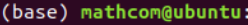

# Tensorflow Serving

딥러닝 모델을 만들고나면, Product에 모델을 배포해야 한다. 이 모델을 추가하는 과정은 직접 API를 만드는 것과 Tensorflow Serving API를 사용하는 것이 있다. 자세한 내용은 [이곳](https://zzsza.github.io/data/2018/07/12/tensorflow-serving-tutorial/)을 참고하도록 하자.

## 환경설정

> AWS Linux 서버 상에서 진행되었음을 참고한다.

### 1. Anaconda 설치

```
curl -O https://repo.anaconda.com/archive/Anaconda3-2019.03-Linux-x86_64.sh

sh Anaconda3-2019.03-Linux-x86_64.sh
```

Thank you와 함께 Anaconda 설치가 완료되었다. 아나콘다를 사용하기 위해서는 컴퓨터를 재부팅해야 하며, 재부팅 후에 그림과 같이, 명령어 입력줄 앞에 (base)가 붙어있다면 정상적으로 설치된 것이다.



설치가 끝나면 아나콘다 가상 환경을 생성하고 활성화 시킨다. 앞으로 실행할 머신러닝 코드들은 이 가상환경 안에서 진행될 것이다.

```
conda create -n AI python=3.7
conda activate AI
```

#### 텐서플로우 설치

텐서플로우 및 필요 라이브러리를 설치한다.

```
pip install tensorflow
```


### 2. Docker 설치

[도커 공식 페이지](https://docs.docker.com/engine/install/ubuntu/)를 참고하거나 `curl -s https://get.docker.com | sudo sh` 명령어로 도커를 설치한다. 스크립트를 실행하면 현재 환경을 파악하고 적절한 과정을 거쳐 도커를 설치해준다. 스크립트가 끝나면 도커가 정상적으로 설치되었는지 `docker -v` 명령어로 확인한다.

```
Got permission denied while trying to connect to the Docker daemon socket at unix:///var/run/docker.sock: Get http://%2Fvar%2Frun%2Fdocker.sock/v1.40/containers/json: dial unix /var/run/docker.sock: connect: permission denied
```

`docker ps` 명령어를 사용했을 때, 이러한 에러 메시지가 뜬다면 다음 명렁어를 입력하도록 한다.

```
$ sudo chmod 666 /var/run/docker.sock
```

위 스크립트는 `/var/run/docker.sock` 파일의 권한을 666으로 변경하여 다른 사용자도 접근 가능하게 변경하도록 해준다.

## Tensorflow Serving

환경설정이 끝난 후 아래의 명렁어를 실행하여 도커로 서빙을 하도록 한다.

```
docker run -p 8501:8501 --mount type=bind,source=$PWD/mobilenet,target=/models/mobilenet -e MODEL_NAME=mobilenet -td tensorflow/serving:2.1.0-rc1
```

